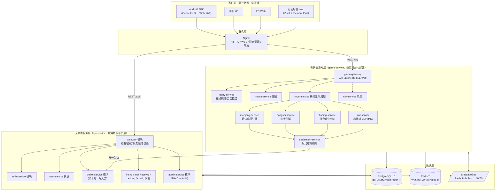

# YANBIAN GAME / 延边游戏 — 总体技术架构（PHASE 1）

> 状态：已评审定稿 v1.0 ｜ 规则版本体系见 §10 ｜ 本文是全项目技术决策的唯一权威来源（Single Source of Truth）。
>
> 资产原则：平台内金币/钻石/积分/奖券/筹码均为**游戏内虚拟娱乐资产**，不可兑换人民币、不可提现、不可用于真实货币赌博。任何涉真实货币功能必须先完成法律/牌照/KYC/AML/支付合规审查后单独立项，本期代码不包含任何现金出入金通道。

---

## 1. 技术选型结论与论证

### 1.1 备选方案对比

| 维度 | Cocos Creator | Unity | Flutter | **Vue3 + Pixi.js + Capacitor（选定）** |
|---|---|---|---|---|
| H5/Web 首屏体积 | 引擎核心 ~1.5MB+，可接受 | WebGL 导出 ≥ 25MB wasm，H5 不可接受 | CanvasKit ~4.5MB，弱网差 | 引擎 gzip 后 ~450KB，分包后大厅首屏 < 2MB |
| 捕鱼类大量精灵/粒子 | 优秀 | 优秀（过剩） | 一般（Web 下 Impeller 不成熟） | 优秀（WebGL2 批渲染、ParticleContainer、对象池） |
| 麻将/扑克 UI（文字、列表、弹窗） | 中（UI 系统偏游戏） | 弱 | 优秀 | 优秀（DOM/CSS 做 UI 层，天然清晰锐利、无字体图集成本） |
| Android 兼容 | 好 | 好 | 好 | 好（Capacitor WebView，Android 7+；低端机走降级画质档） |
| APK 体积 | ~25MB 起 | ~40MB 起 | ~18MB 起 | **~8MB 起**（WebView 壳 + 资源分包/CDN 热更新） |
| 热更新 | 自研/第三方 | 受限 | 受限 | **天然支持**（Web 资源即热更新，版本清单控制） |
| 与服务端共享代码 | TS，可共享 | C#，不可 | Dart，不可 | **TS 全栈：协议/规则配置/牌型判定表在 packages 层直接复用** |
| 纯代码仓库 CI 构建 | 需编辑器管线（二进制场景/资源库） | 需编辑器与许可证 | 可 | **完全代码化，`pnpm build` 即产物，适配 CI/CD 与代码评审** |
| 团队维护成本 | 需专职 Cocos 工程师 | 高 | 中 | 低（Web 技术栈人才充足） |

**客户端结论：Vue 3 + TypeScript（大厅/系统 UI，DOM 层）+ Pixi.js 8（游戏渲染，WebGL 层）+ Capacitor 6（Android APK 壳）。**

理由汇总：
1. 四个游戏中三个（麻将/红十/水果机）是「强 UI + 中度动画」类型，DOM/CSS + WebGL 混合是体验与开发效率的最优组合；捕鱼是唯一的重渲染场景，Pixi 的批渲染 + 粒子容器 + 对象池足以在中低端 Android 上跑满 60FPS（详见 docs/09-performance.md 预算表）。
2. 一套代码覆盖 Android APK / 手机 H5 / PC Web 三端，账号与状态天然互通；APK 即 WebView 壳 + 本地资源包，游戏资源按 Bundle 从 CDN 加载，具备完整热更新能力（清单版本 + 强更/可选更策略）。
3. TS 全栈使「协议、错误码、规则配置 Schema、牌型枚举」在 `packages/protocol`、`packages/game-common` 中**只写一份**，服务端校验与客户端提示永不漂移——这是棋牌类产品最常见的线上事故源。
4. Cocos Creator 是本方案的落选者中最接近的：若后期捕鱼要升级为 3D 渔场（Boss 3D 模型、水体折射），再以独立 Bundle 方式引入 Cocos/3D 渲染专用子包，不影响平台层。该迁移路径已在 §11 预留。

### 1.2 服务端选型

| 维度 | Go | Java Spring | **Node.js + TypeScript（选定）** |
|---|---|---|---|
| 单机 WS 并发 | 极强 | 强 | 强（uWS/ws，单进程 3–5 万连接；房间进程水平扩展） |
| 计算密集（胡牌判定/RTP 模拟） | 强 | 强 | 足够（判定为查表+回溯，微秒级；已用基准测试验证） |
| 与客户端共享协议/规则 | 不可 | 不可 | **可（决定性优势）** |
| 团队/招聘 | 中 | 中 | 易 |
| 内存占用 | 低 | 高 | 中 |

**结论：Node.js 22 + TypeScript + Fastify（HTTP）+ ws（WebSocket），多进程按角色部署。**
棋牌房间服务的瓶颈是「连接数与广播」而非 CPU；采用**无状态 API 层 + 有状态房间分片**架构后，横向扩容与 Go 等价，而协议共享带来的正确性红利是 Go 无法提供的。若未来单房间 CPU 出现热点（如万人捕鱼房），`fishing-service` 模块边界清晰，可单独用 Go 重写并通过相同 Redis/NATS 协议接入——服务拆分（§3）已保证这条替换路径。

### 1.3 基础设施选型

| 组件 | 选型 | 理由 |
|---|---|---|
| 数据库 | PostgreSQL 16 | 账本需要严格事务/行锁/约束（CHECK 余额非负、唯一幂等键）；JSONB 存回放事件流与规则快照 |
| 缓存/在线状态 | Redis 7 | 在线人数、路由表（user→room→node）、限流计数、验证码、匹配队列 |
| 服务间消息 | Redis Pub/Sub（首期）→ NATS（扩容期） | 首期节点数 < 10，Redis 足够且少一个运维组件；接口层已抽象 `MessageBus`，切 NATS 仅换驱动 |
| 反向代理 | Nginx | HTTPS/WSS 终结、静态资源、基础限流 |
| 容器 | Docker + docker-compose（dev/staging），生产可平移 K8s | 见 docs/10-deployment.md |
| 监控 | Prometheus + Grafana（/metrics 已埋点）| 见 docs/10-deployment.md |
| 日志 | pino 结构化 JSON → Loki | 统一字段：ts/level/service/server_id/user_id/room_id/round_id/request_id |

---

## 2. 系统架构图



## 3. 服务拆分与职责

**部署形态说明（重要工程决策）**：所有服务按下表拆为**独立模块**（独立目录、独立入口、禁止跨模块直接 import 内部实现，只能走 `packages/*` 公共层或 MessageBus）。物理部署上首期编译为两个可执行体 `api-service`（无状态）与 `game-service`（有状态），通过 `SERVICE_ROLES` 环境变量决定每个容器实例装载哪些模块——例如生产环境 compose 中 `game-mahjong` 容器只装 `room,mahjong,settlement`。这样得到微服务的**边界、独立扩容与独立发布能力**，又避免首期 20+ 仓库的分布式运维成本；任何模块日后可无痛抽成独立进程（入口文件已单独存在）。模块间调用一律走接口 + 总线，**不存在"塞在一个 server 项目里"的耦合**。

| 服务 | 模块路径 | 职责 | 状态 |
|---|---|---|---|
| gateway-service | services/api/src/modules/gateway | REST 路由、全局限流、请求签名与时间戳/Nonce 校验、CORS | 无状态 |
| auth-service | services/api/src/modules/auth | 游客/手机号/验证码/密码登录、Token 签发与刷新、强制下线、设备指纹 | 无状态 |
| user-service | services/api/src/modules/user | 资料、等级/VIP、登录记录、多设备管理 | 无状态 |
| wallet-service | services/api/src/modules/wallet | **账本唯一写入方**：余额、交易、Ledger、幂等、调账 | 无状态（锁在 DB） |
| settlement-service | services/game/src/modules/settlement | 对局结算编排：收集 RoundResult → 调 wallet 批量记账 → 写战绩 | 有状态编排 |
| game-gateway | services/game/src/modules/wsgateway | WS 连接、鉴权握手、心跳、seq/ACK、断线重连、会话路由 | 有状态 |
| lobby-service | services/game/src/modules/lobby | 在线统计、大厅推送、公告广播 | 有状态 |
| match-service | services/game/src/modules/match | 各游戏匹配队列（Redis ZSET）、按段位/金币档位撮合 | 无状态 |
| room-service | services/game/src/modules/room | 房间创建/加入/准备/解散、房间号池、私人房密码、旁观 | 有状态 |
| mahjong-service | services/game/src/modules/mahjong | 延边麻将规则引擎 + 桌面状态机 | 有状态 |
| hongshi-service | services/game/src/modules/hongshi | 红十规则引擎 + 桌面状态机 | 有状态 |
| fishing-service | services/game/src/modules/fishing | 鱼群生成、命中判定（RTP 池）、射击频控 | 有状态 |
| slot-service | services/game/src/modules/slot | CSPRNG 结果生成、Paytable 计算、审计日志 | 无状态 |
| ranking-service | services/api/src/modules/ranking | 日/周/总榜（Redis ZSET + 定时落库） | 无状态 |
| activity-service | services/api/src/modules/activity | 签到/任务/活动，后台配置驱动 | 无状态 |
| mail-service | services/api/src/modules/mail | 站内邮件、附件奖励领取（走 wallet） | 无状态 |
| friend-service | services/api/src/modules/friend | 好友/申请/搜索/邀请 | 无状态 |
| chat-service | services/game/src/modules/chat | 房间快捷语/表情（预留私聊） | 有状态 |
| risk-service | services/game/src/modules/risk + services/api/src/modules/risk | 频率异常、胜率异常、多号同设备/IP、账变异常报警 | 双侧 |
| admin-service | services/api/src/modules/admin | 后台全部 API、RBAC、二次确认、Audit Log | 无状态 |
| config-service | services/api/src/modules/config | 品牌/游戏/规则/概率配置版本化下发 | 无状态 |
| notification-service | services/api/src/modules/notification | 公告、跑马灯、推送预留 | 无状态 |
| log-service | 横切（packages/game-common/logger） | 结构化日志、request_id 贯穿 | 横切 |

## 4. 项目目录

```
/
├── apps/
│   ├── client-game/          # 游戏客户端：Vue3 + Pixi（APK/H5/PC Web 同源）
│   │   ├── src/
│   │   │   ├── design/       # Design Tokens / 全局样式
│   │   │   ├── ui/           # 通用组件（按钮/弹窗/Toast/骨架屏…）
│   │   │   ├── views/        # 启动/登录/大厅/我的/活动/战绩/好友…
│   │   │   ├── games/
│   │   │   │   ├── mahjong/  # 延边麻将桌（DOM+SVG 牌面 + 动画层）
│   │   │   │   ├── hongshi/  # 红十牌桌
│   │   │   │   ├── fishing/  # 捕鱼（Pixi 场景）
│   │   │   │   └── slot/     # 水果机（Pixi 卷轴）
│   │   │   ├── net/          # WS 客户端（seq/ACK/重连/重同步）+ REST
│   │   │   ├── i18n/         # zh-CN / ko
│   │   │   └── audio/        # BGM/SFX 管理（分通道音量）
│   │   └── capacitor.config.ts
│   └── admin-web/            # 运营后台：Vue3 + Element Plus + ECharts
├── services/
│   ├── api/                  # 无状态服务群（模块按 SERVICE_ROLES 装载）
│   │   └── src/modules/{gateway,auth,user,wallet,ranking,activity,mail,friend,admin,config,notification,risk}
│   └── game/                 # 有状态游戏服务群（模块按 GAME_ROLES 装载）
│       └── src/modules/{wsgateway,lobby,match,room,mahjong,hongshi,fishing,slot,settlement,chat,risk}
├── packages/
│   ├── protocol/             # WS/REST 协议、事件名、错误码、DTO（三端共享）
│   └── game-common/          # 牌/麻将基础库、RNG、状态机、回放事件流、规则配置 Schema
├── database/
│   ├── migrations/           # 编号 SQL 迁移（唯一 Schema 权威）
│   └── seeds/                # 初始数据（游戏、默认规则包、RBAC、管理员）
├── deploy/
│   ├── docker-compose.yml    # dev/staging 全栈
│   ├── docker-compose.prod.yml
│   ├── nginx/                # HTTPS/WSS/限流配置
│   ├── prometheus/           # 监控配置
│   └── backup/               # pg_dump 定时备份脚本
├── tests/                    # 跨服务集成/负载测试脚本
├── scripts/                  # 迁移、造数、压测入口
└── docs/                     # 本目录：架构/DB/协议/规则确认表/安全/路线图
```

## 5. 统一虚拟钱包架构 → 详见 docs/04-wallet.md

核心不变式（在此声明，全项目强制）：
1. `wallet-service` 是唯一允许写 `wallet_*` 表的模块；游戏服务只能提交 `SettlementRequest`。
2. 每笔账变 = 一行 `wallet_transactions`（含 balance_before/after）+ 账本分录 `wallet_ledger_entries`（双录：用户账户 与 系统对手账户，全局借贷平衡，`SUM(amount)==0` 可审计）。
3. 幂等键 `(idempotency_key)` 全局唯一；同 `round_id` 同类型结算重复提交 → 返回首次结果，不重复入账。
4. 扣款使用 `SELECT … FOR UPDATE` 行锁 + `CHECK (balance >= 0)` 双保险；并发 100 扣款是发布前必测项。
5. 管理员调账不能直接改余额：必须走 `wallet_adjustments`（原因/审批/前后余额/IP）→ 生成普通交易 → 永久 Audit Log，任何删除被数据库触发器拒绝。

## 6. WebSocket 协议 → 详见 docs/03-protocol.md

信封统一为 `{v, requestId, event, seq, timestamp, data, sig?}`；服务端下行带 `ack`（对应上行 seq）与服务端自增 `push_seq`，客户端据 `push_seq` 缺口触发全量重同步。心跳 10s、超时 30s、断线保留会话 90s（游戏中 120s 且启用托管）。重连后服务端下发 `room.sync` 快照（含本人完整手牌、他人仅牌数、当前行动者、剩余倒计时）。

## 7. 防作弊架构 → 详见 docs/06-security.md

要点：服务端权威（胡牌/结果/结算全部服务端）、最小信息下发（他人手牌不出服务器）、CSPRNG、请求签名（HMAC，密钥登录时下发且绑定会话）、Nonce+Timestamp 防重放、分层限流、捕鱼弹道成本先扣后飞、水果机先结算后播动画、风控事件流。

## 8. 延边麻将 / 红十规则配置架构

两者均为「公共引擎 + 规则包」：
- `packages/game-common/mahjong/` 提供牌库、洗发牌、动作合法性、胡牌判定器（模块化牌型 hand_patterns/*）、优先级仲裁器（Action Priority Engine）。
- 延边规则以 `rule_version = yanbian_2026_01` 的**配置包**存于 `game_configs` 表并随对局快照进 `game_rounds.rule_snapshot`。
- 所有存在地区差异的项一律配置化，未确认项使用文档标注的临时默认值并在《规则确认表》中列明待确认状态：docs/05-game-rules/yanbian-mahjong-rules-confirmation.md、hongshi-rules-confirmation.md。

## 9. 捕鱼同步与水果机结果架构

- 捕鱼：服务端以「波次脚本 + 路径 ID + 出生时间戳」广播鱼群（不逐帧同步）；客户端用 `(path_id, spawn_ts, now)` 插值位置。射击先经服务端验余额/炮倍/频率扣费并回执 `bullet_id`；命中请求带 `bullet_id + fish_id`，服务端校验鱼存活窗口后按 RTP 池判定死亡与掉落。详见 docs/05-game-rules/fishing-architecture.md。
- 水果机：客户端仅发 `slot.spin{bet, lines, requestId}`；服务端 CSPRNG 抽卷轴停位 → 查 Paytable → **先入账后返回** → 客户端播动画。每局写 `slot_rounds`（含 paytable_version、rng 审计信息）。详见 docs/05-game-rules/slots-architecture.md。

## 10. 版本体系

每场对局快照三元组：`game_version`（引擎代码版本，随发布）、`rule_version`（规则包，如 yanbian_2026_01）、`config_version`（数值配置版本，含 paytable/RTP）。历史战绩与回放按快照重建，配置修改全部留痕（config_versions + audit_logs）。

## 11. 扩展路径（已预留）

新增斗地主/跑得快/德州：新建 `services/game/src/modules/<game>` + 客户端 `games/<game>` Bundle + `games` 表登记，平台层零改动。捕鱼 3D 化：独立渲染子包替换 `games/fishing` 内部实现，协议不变。单服务抽离：模块入口已独立，改 compose 即可。

## 12. PHASE 0–19 路线图 → 详见 docs/08-roadmap.md
