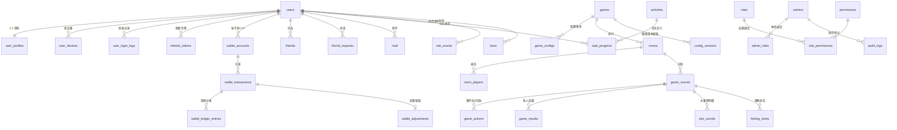

# 数据库设计（PostgreSQL 16）

> 权威 Schema 以 `database/migrations/*.sql` 为准，本文为 ER 说明、索引与运维策略。
> 所有服务端生成 ID：`user_id`（数字 UID，从 100000 起）、`room_id`、`round_id`、`transaction_id` 均由服务端雪花变体生成（41bit 时间戳 + 10bit 节点 + 12bit 序列），客户端永不提交自造 ID。

## 1. ER 总览

## 2. 表清单（46 张，按域）

### 账号域
| 表 | 说明 | 关键列/约束 |
|---|---|---|
| users | 账号主表 | id(uid) PK、guest_key UNIQUE、phone UNIQUE(可空)、password_hash、status(normal/frozen/banned)、created_ip |
| user_profiles | 资料 | user_id PK/FK、nickname、avatar_id、gender、level、vip、exp |
| user_devices | 设备 | (user_id, device_id) UNIQUE、device_type、os_version、app_version、last_seen_at、trusted |
| user_login_logs | 登录流水 | user_id、ip、device_id、login_type、result、created_at；按月分区 |
| refresh_tokens | 刷新令牌 | token_hash UNIQUE、user_id、device_id、expires_at、revoked_at（旋转失效） |
| sms_codes | 验证码 | phone、code_hash、purpose、expires_at、used_at、send_ip（限频依据） |

### 钱包域（详见 docs/04-wallet.md）
| 表 | 说明 |
|---|---|
| wallet_accounts | (user_id, currency) UNIQUE；balance BIGINT CHECK(balance>=0)；version 乐观锁；系统账户 user_id=0 系列 |
| wallet_transactions | 交易主表：transaction_id PK、idempotency_key UNIQUE、balance_before/after、type、game_id/room_id/round_id、server_id、status、metadata JSONB；按月分区 |
| wallet_ledger_entries | 借贷双录分录：每笔交易两行（用户/系统对手账户）amount 相加为 0 |
| settlements | 对局结算单：round_id+type UNIQUE 防重复结算；状态机 pending→posted |
| wallet_adjustments | 管理员调账：admin_id、reason、approve_admin_id、before/after、ip；行级禁止 DELETE（触发器） |

### 游戏域
| 表 | 说明 |
|---|---|
| games | 游戏登记：code(mahjong_yanbian/hongshi/fishing/slot_fruit)、status、min_client_version |
| game_versions | 引擎版本发布记录 |
| game_configs | 规则/数值配置：game_id、rule_version、config JSONB、status(draft/active/retired)、发布留痕 |
| config_versions | 每次配置修改的 diff 留痕（admin_id、before、after、reason、ip） |
| rooms | room_id PK、game_id、mode(match/private)、room_no(6位显示号，活跃期 UNIQUE)、owner_id、rule_snapshot JSONB、state、server_node |
| room_players | (room_id, seat) UNIQUE、user_id、state(ready/playing/offline/trustee)、score |
| game_rounds | round_id PK、room_id、game_id、rule_snapshot、game_version、rule_version、config_version、started_at/ended_at、result_summary JSONB；按月分区 |
| game_actions | 回放事件流：round_id、seq、actor、action、payload JSONB（含发牌/摸/出/吃/碰/杠/胡/托管）；按月分区 |
| game_results | (round_id, user_id) UNIQUE、score_change、balance_after、detail JSONB（牌型/番数/倍率） |
| mahjong_rounds / hongshi_rounds | 各游戏扩展明细（听牌、庄家、番型统计等） |
| fishing_sessions | 玩家进出渔场会话（进出金币、发射数、命中数、RTP 实际值） |
| fishing_shots | 射击流水：bullet_id PK、cost、multiplier、fish_id、hit、reward；按天分区 |
| slot_rounds | spin 明细：round_id、bet、lines、rng_audit JSONB（结果索引与证明）、win、paytable_version |
| slot_paytables | 赔付表版本：symbols、reels、lines、rtp_target、status |

### 社交/运营域
| 表 | 说明 |
|---|---|
| friends | (user_id, friend_id) UNIQUE 双行存储 |
| friend_requests | 申请状态机 |
| mail | 站内信：to_user、title、body、attachments JSONB、read_at、claimed_at |
| announcements | 公告：标题/内容/生效区间/平台/排序 |
| activities | 活动定义：type(sign_in/task/login_reward…)、config JSONB、生效期 |
| tasks | 任务定义：条件表达式(config JSONB)、奖励、周期(daily/weekly) |
| task_progress | (user_id, task_id, period_key) UNIQUE、progress、claimed_at |
| rankings | 榜单落库快照（实时榜在 Redis） |
| notifications | 推送/跑马灯记录 |

### 风控/后台域
| 表 | 说明 |
|---|---|
| risk_events | 事件：user_id、type、severity、evidence JSONB、handled_by |
| bans | 封禁：target_type(user/device/ip)、target、reason、until、operator |
| admins | 后台账号：username UNIQUE、password_hash、totp_secret(预留)、status |
| roles / permissions / role_permissions / admin_roles | RBAC |
| audit_logs | 后台全操作审计：admin_id、action、target、before/after JSONB、ip、created_at；**禁止 UPDATE/DELETE（触发器）** |
| server_nodes | 游戏节点注册与心跳 |

## 3. 索引设计（关键）

- `users(phone)`、`users(guest_key)`、`user_profiles(nickname)`（后台搜索用 trigram 可后加）
- `wallet_transactions(user_id, created_at DESC)`（个人流水）、`(round_id)`、`(type, created_at)`（后台统计）、`idempotency_key` UNIQUE
- `game_rounds(room_id)`、`(game_id, started_at DESC)`；`game_results(user_id, created_at DESC)`（战绩查询主路径）
- `game_actions(round_id, seq)` UNIQUE（回放重建）
- `fishing_shots(user_id, created_at)`、`(round_id)`；`slot_rounds(user_id, created_at DESC)`
- `audit_logs(admin_id, created_at DESC)`、`(action, created_at DESC)`
- `risk_events(user_id, created_at DESC)`、`(type, severity)`

## 4. 分区与分库分表策略

- **首期（≤ 50 万注册 / 1 万在线）**：单库；高写入流水表按月/按天**声明式分区**（login_logs、wallet_transactions、game_rounds、game_actions、fishing_shots），旧分区可转储归档。
- **中期**：读写分离（1 主 2 从，流水查询走从库）；Redis 承担实时榜/在线统计。
- **远期**：按 user_id 哈希分库（16 库预留：所有含 user_id 的表以 user_id 作分片键；round/room 明细以 round_id 前缀路由）；跨片查询走 OLAP 侧（同步到 ClickHouse 做运营报表）。
- ID 全部为服务端雪花 ID，天然支持分片迁移，无自增依赖。

## 5. 备份与恢复

- 每日 02:00 `pg_dump -Fc` 全量 + WAL 归档（`archive_command`），保留 30 天（脚本 deploy/backup/backup.sh，compose 内置 cron 容器）。
- 每周恢复演练脚本 `deploy/backup/restore-verify.sh`：还原到临时库并校验 `SUM(ledger.amount)=0` 与行数。
- 账本与审计表额外逻辑导出（CSV，WORM 存储建议）。

## 6. 数据完整性硬约束

- `wallet_accounts.balance >= 0`（CHECK）
- `wallet_ledger_entries` 每 transaction_id 双行且 SUM=0（入账函数保证 + 对账任务复核）
- `settlements(round_id, settle_type)` UNIQUE → 重复结算物理不可能
- `audit_logs` / `wallet_adjustments` / `wallet_ledger_entries`：触发器拒绝 UPDATE/DELETE（管理员亦不可无痕篡改）
