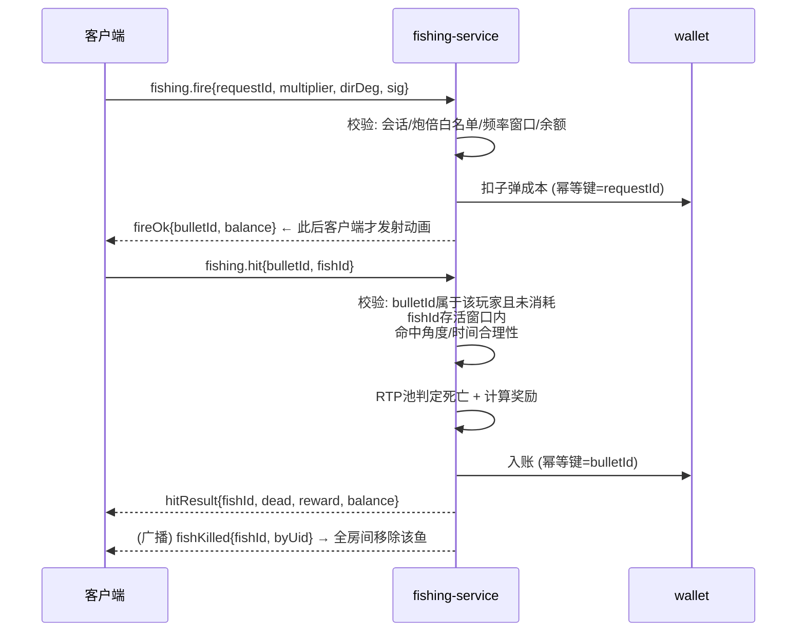

# 捕鱼 — 同步架构与服务端权威设计

## 1. 职责边界

| 客户端（纯表现） | 服务端（唯一权威） |
|---|---|
| 鱼群位置插值渲染、子弹飞行动画、碰撞视觉、特效/音效/震屏、金币飞行 | 鱼的存在与生命周期、子弹成本扣费、命中判定、奖励计算、余额变化、技能判定、Boss 结果 |

## 2. 鱼群同步（波次脚本模型，不逐帧同步）

服务端每渔场房间维护「波次时间轴」：

```
FishSpawn {
  fishId        // 服务端唯一
  fishType      // 决定倍率/体型/路径速度
  pathId        // 预置贝塞尔路径库编号（三端共享 packages/game-common/fishing/paths.ts）
  spawnAtMs     // 服务器时钟出生时间
  speedScale    // 路径速度系数
  ttlMs         // 游出屏幕时间（由路径长度推导）
}
```

- 广播 `fishing.waveStart{waveId, spawns[]}`（一次广播一波，几十条鱼一个包）。
- 客户端用 `serverNow = clientNow + offset`（心跳校时）计算每条鱼在路径上的参数位置 `t = (serverNow - spawnAtMs)*speedScale / pathDuration`，全房间视觉一致。
- Boss 出场：提前 5s 推 `fishing.bossWarning`（全屏预告演出），Boss 有独立血量池与多段掉落脚本。
- 服务端仅保存活鱼表 `{fishId → spawn}`；`serverNow > spawnAtMs + ttlMs` 即判定游走（命中该鱼返回 MISS_GONE）。

## 3. 射击与命中流程（先扣费，后表现）



## 4. 数学模型（可后台配置，config_versions 留痕）

- 每种鱼配置 `baseOdds`（赔率）；单发命中死亡概率 `p = (1/baseOdds) * rtpFactor`。
- `rtpFactor` 由**房间盈亏池控制器**动态微调以收敛到目标 RTP（如 96%，纯虚拟积分娱乐用途）：池子过盈→上调，过亏→下调，边界夹紧（防连杀异常）。
- 死亡奖励 = `bulletCost × multiplier × baseOdds`（可另配掉落表：额外奖券/道具）。
- 随机源：Node `crypto.randomInt`（CSPRNG）；每次判定写审计字段（round/bullet/fish/odds/rtpFactor/roll）入 `fishing_shots`。

## 5. 防作弊清单（逐项落实）

| 攻击 | 防御 |
|---|---|
| 修改子弹价格/炮倍 | 炮倍白名单在服务端配置；成本=服务端算，客户端提交倍率枚举值 |
| 无限金币/假击杀 | 命中必须引用服务端签发的 `bulletId`（一次性消耗，Redis SETNX）+ 存活 `fishId` |
| 高速开枪 | 服务端滑动窗口频控（默认 ≤8 发/秒，按炮台等级配置），超限静默丢弃+风控计数 |
| 重放 fire/hit | requestId/bulletId 幂等；WS 信封 seq 单调；签名绑定会话密钥 |
| 修改 APK 内存改余额 | 余额仅服务端记账，客户端显示值每次以服务器回执为准 |
| 伪造 WS 消息 | 握手鉴权 + 敏感事件 HMAC 签名 + 服务端全量合法性校验 |
| 命中不可能的鱼（屏外/角度） | 服务端校验鱼存活时间窗 + 发射方向与鱼路径位置的角度容差（可配，默认 ±25°，容忍网络抖动） |
| 刷退出进场套利 | 进出场会话 `fishing_sessions` 记录带入/带出，异常频繁进出触发风控 |

## 6. 性能预算（客户端）

同屏 ≤ 60 鱼 + 4 玩家子弹 + 粒子：Pixi ParticleContainer + 对象池（子弹/金币/爆点全部复用）、纹理图集单批渲染、低端机档位（关闭水波折射/减半粒子/30FPS 保底档）。内存防泄漏：离场销毁 Bundle 纹理，30 分钟长跑内存曲线纳入发布前测试。
